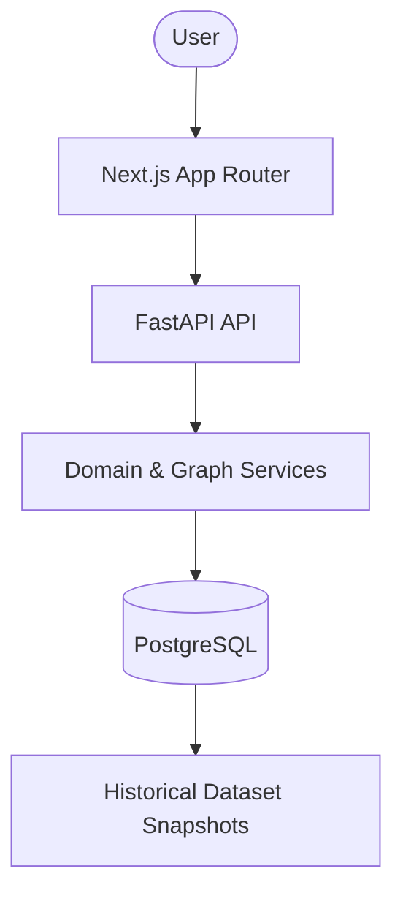

# RailGati

An open-source Indian railway intelligence platform built on historical timetable schedules and graph analytics.

RailGati explores railway operations through data. By ingesting versioned snapshots of the railway network, it provides a deep look into network topology, historical station reachability, scheduled train performance, and topological bottlenecks.

Rather than competing with real-time passenger booking apps, RailGati serves as a pure analytical and discovery tool for railway enthusiasts, data engineers, and researchers to understand how the network structurally operates over time.

## 1. What RailGati Does

RailGati operates exclusively on historical dataset snapshots. It evaluates structural network metrics rather than live operational conditions.

| Area | What it provides |
|---|---|
| **Journey Discovery** | Transfer-free (direct) and one-transfer historical timetable journey paths. |
| **Station Intelligence** | Analysis of historical passing trains and minimum topological network hops to other destinations. |
| **Train Intelligence** | Longest scheduled halts, slow network segments, and top scheduled route overlaps between different train services. |
| **Network Analytics** | Biconnected block traversals, edge flow capacity, and topological bridge bipartitions using algorithmic graph theory. |

## 2. Current Features

### Journey Discovery
Provides transfer-free and limited 1-transfer routing between stations based on static timetable snapshots.
* *Note: Does not account for current availability, cancellations, or guaranteed passenger connections.*

### Station Intelligence
Historical station profiles (`/stations/[code]`), including lists of all scheduled trains and topological destination reachability bounding out up to 5 network hops (`/stations/[code]/reachability`).

### Train Intelligence
Deep dives into individual scheduled services (`/trains/[train_number]`), revealing:
- **Longest Scheduled Halts:** Surfaces stations where the train historically had the longest scheduled dwelling times.
- **Slower-than-Average Segments:** Identifies segments where the train historically scheduled significantly slower travel times than the network average.
- **Longest Shared Route Segments:** Surfaces trains that shared the longest identical sequence of contiguous stations.

### Network Intelligence
Graph algorithms running over the canonical `RailwayNetworkEdge` topology:
- **Bridge Bipartition Size:** Measures the network fracturing impact if an edge were removed (Edmonds-Karp Max-Flow).
- **Topological Biconnected Blocks:** Analyzes structural redundancies across the active snapshot.

## 3. Important Data Scope

**RailGati operates strictly on historical, static dataset snapshots.**

- Results do **not** represent live railway status, delays, or disruptions.
- Historical train presence does **not** guarantee current operational availability.
- Historical topological reachability (network hops) is **not** equivalent to a feasible passenger itinerary (transfers).
- Route similarities surfaced in train profiles do **not** imply that trains are viable operational substitutes.

## 4. How It Works

RailGati is built as a modern modular monolith prioritizing analytical performance and deterministic results.

- **Frontend:** Built with Next.js (App Router), React, and Tailwind CSS. Employs aggressive React Server Components (RSC) and `<Suspense>` boundaries for non-blocking analytical rendering.
- **Backend:** A FastAPI Python service powered by SQLAlchemy. Network graph algorithms run dynamically per-request over the PostgreSQL data layer.
- **Data:** Railway data is heavily normalized and versioned into deterministic `dataset_snapshots`.
- **Infrastructure:** Containerized PostgreSQL deployment orchestrated via Docker Compose.

## 5. Architecture



- **Separation of Concerns:** The frontend strictly consumes the backend API and maintains no local database state.
- **Snapshot Isolation:** All graph traversals and queries explicitly lock to a single active `timetable_snapshot_id`.
- **Graph Processing:** Complex topological algorithms (like Edmonds-Karp) execute dynamically at runtime to avoid heavy, stale precomputation.

## 6. Data & Provenance

The system relies on static datasets ingested into versioned database snapshots.
- **Historical Nature:** All analytics are strictly backward-looking.
- **Deterministic:** Because data is isolated by snapshot, all analytical results are fully deterministic and reproducible.

## 7. Tech Stack

| Layer | Technology |
|---|---|
| **Frontend** | Next.js 16 (App Router), TypeScript, Tailwind CSS, pnpm |
| **Backend** | Python 3.12, FastAPI, SQLAlchemy 2, uv |
| **Database** | PostgreSQL |
| **Testing** | pytest, ruff, mypy, eslint |
| **Infrastructure** | Docker, Docker Compose |

## 8. Project Structure

```text
railGati/
├── backend/
│   ├── src/railgati/
│   ├── tests/
│   └── pyproject.toml
├── frontend/
│   ├── src/app/
│   └── package.json
├── docker/
│   └── docker-compose.yml
├── docs/
│   ├── architecture/
│   └── ...
└── README.md
```

## 9. Local Development

### Prerequisites
- Python 3.12+
- Node.js 22+
- `uv` (Python package manager)
- `pnpm` (Node package manager)
- Docker & Docker Compose

### 1. Environment Configuration
```bash
git clone <repository-url> railGati
cd railGati
cp .env.example .env
cp frontend/.env.example frontend/.env.local
```

### 2. Database Startup
```bash
docker compose -f docker/docker-compose.yml up -d
```

### 3. Backend Startup
```bash
cd backend
uv sync --all-extras
uv run uvicorn railgati.main:app --reload --port 8000
```
API Documentation available at: `http://localhost:8000/docs`

### 4. Frontend Startup
```bash
cd frontend
pnpm install
pnpm dev
```
Application available at: `http://localhost:3000`

### 5. Testing & Validation
**Backend:**
```bash
cd backend
uv run pytest tests/
uv run ruff check src/ tests/
uv run mypy src/
```

**Frontend:**
```bash
cd frontend
pnpm lint
pnpm build
```

## 10. API

The FastAPI backend exposes RESTful endpoints grouped by domain:
- `/api/v1/stations/` - Search and historical profile endpoints.
- `/api/v1/trains/` - Historical scheduled train timings and halt data.
- `/api/v1/network/` - Topological graph metrics (reachability, edge capacity, shared route similarities).
- `/api/v1/snapshots/` - Dataset versioning.

All analytics requests accept and validate constraints such as `max_hops` or `limit` to ensure bounded execution time.

## 11. Engineering Principles

- **Explicit Historical Scope:** The application strictly enforces the distinction between historical analytical data and live operational systems.
- **Snapshot Isolation:** A strict snapshot architecture prevents graph inconsistencies across dataset updates.
- **Bounded Graph Traversal:** All recursive CTEs and topological searches are explicitly bounded at the API layer to prevent database exhaustion.
- **Modular Monolith:** Built for vertical scalability. Microservices and external graph databases (like Neo4j) are intentionally deferred until scale dictates necessity.
- **₹0 Budget:** Developed entirely on free, open-source infrastructure without reliance on paid APIs, specialized hosting, or LLM services.

## 12. Roadmap

### Current (v2.4)
- Core snapshot architecture and data modeling.
- FastAPI backend and Next.js React Server Components frontend.
- Station intelligence and historical direct/one-transfer itineraries.
- Bounded topological network reachability (hops vs. transfers).
- Train intelligence analytics (Longest Scheduled Halts, Slower-than-Average Segments, Longest Shared Route Segments).

### Planned
- **v2.5+**: Advanced historical network evolution tracking.
- Intelligent trip planning agents.
- Natural-language railway exploration interfaces.
- Machine Learning models for historical delay predictions.

## 13. Project Status
**V2.4 Complete.** The repository has finalized the foundation for historical network topology and train graph analytics.

## 14. Contributing
Contributions are welcome! Please ensure that:
1. All changes respect the historical/static semantics of the application.
2. Analytics remain deterministic and tied to snapshot isolation.
3. You run `pytest` and `pnpm lint` before submitting a Pull Request.
